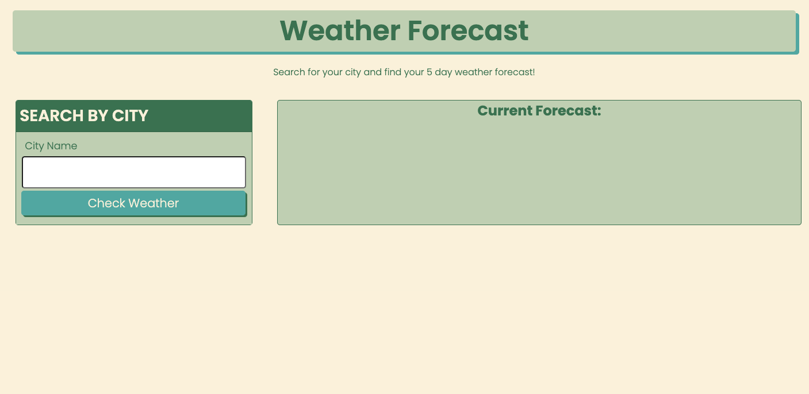
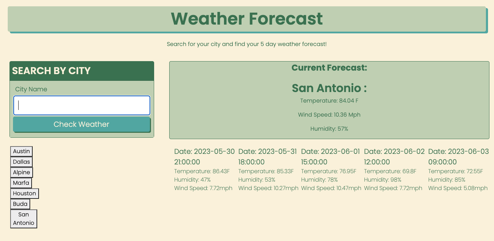

# Weather Forecast Dashboard
## Jayné M. Valverde
[Link to deployed forecast dashboard]()

## 5 day weather forecast 
* Upon launching the APP you are presented with a 'Search by City' input card, and a blank card to the right where you current cities forecast will appear.
* When you submit your cities name the 'Current Forecast' will populate in the blank card on the right. Displaying the city name, temperature, wind speed and humidity for the day. 
    * The '5 day forecast' of that city will also populate right below the 'Current Forecast' showing the date, temperature, humidity and wind speed of each corrisponding day. 
* As the user searches for new cities, the previous city searches will save into local storage for future reference. 

# Issues with app 
* I underforunatly was not able to get get an 'eventListener' set up for the buttons created for the 'saved searches'. The cities **are** saved to local storage, I just need to access them. 
* I was not able to figure out a way to display **weather icons** for visual display of the weather. I know they exist within the console and the API arrays, I was just having a hard time finding the right way to code it into my exisiting javaScript functions.
* The flex boxes and containerst that are holding the cards for all populated information, esp the '5 day forecast' isn't working as smoothly as I would like. I was struggeling for a long time with the flex boxes & grid systems within bootcamp. I was finally able to get them to display into a row, which took me over two days to figure out, but the alignment isn't where I want it to be. 
* The date formate in the '5 day forecast' is not easy to read. Although its readable, I was not able to find a way to format it in a cleaner more readable way. 
     
* The app is funcitonal to a semi-acceptable point but it still needs a lot of work on my end. 

## Forecast App Preview 

## Resources 

**Ask BCS**:  
Ask BCS was my life line this week. I had a really hard time getting my API to simply just populate data onto my website. Alot of it was naming conventions and some was just HTML / Bootstrap styling. They were very kind and helpful with me and talked me a lot of small problems I had with this project. 

**Alistair Rowden**:  
He was my tutor this week. He helped me out a GREAT deal in understanding more about local storage. he broke it down in terms that were easier for me to understand. I have been struggeling with understanding how it works so I am am really glad he helped me in a way that taught me how to utilize local storage within my own code. 

**Get Bootstrap Website**:  
[getbootstrap](https://getbootstrap.com/docs/4.0/utilities/flex/)  
Mostly used this website for understanding grid systems, sizing and flex boxes. 